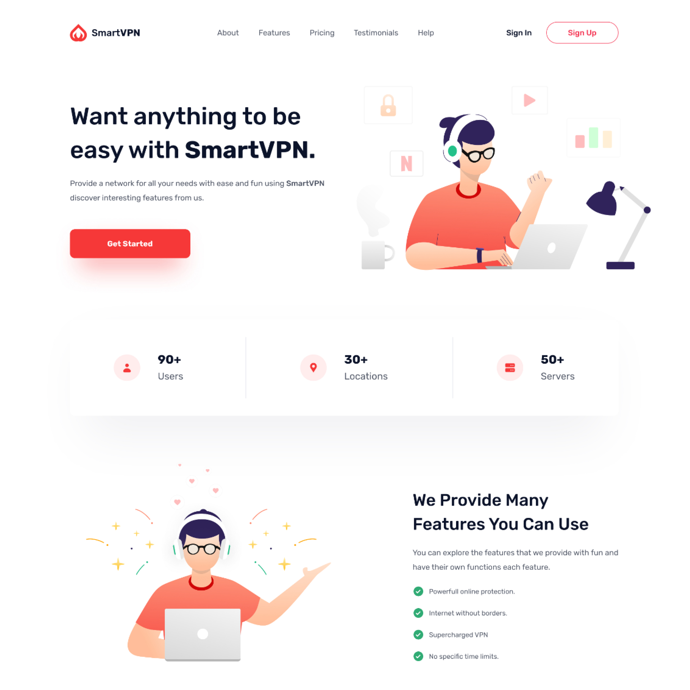

# smartvpn landing-page

>Front end Challenge 1

## Welcome! 👋

Thanks for checking out this front-end coding challenge.

**To do this challenge you need a basic understanding of HTML and CSS.**

## Where to find everything

Your task is to build out this landing page and get it looking as close to the design as possible. All the files needed are included in the `/project-files` folder.

The designs are in JPG static format. This will mean that you'll need to use your best judgment for styles such as `font-size`, `padding` and `margin`. This should help train your eye to perceive differences in spacings and sizes.

The Design file(figma) is included in order to inspect the design in more detail you can [Check the Design Here](https://www.figma.com/file/Pxiku3dcGuyBmUcSovrqu9/Vpn-Landing-Page?node-id=0%3A1).

You will find all the required images in the `/images` folder. The images are already optimized.

